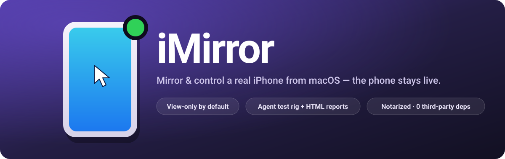
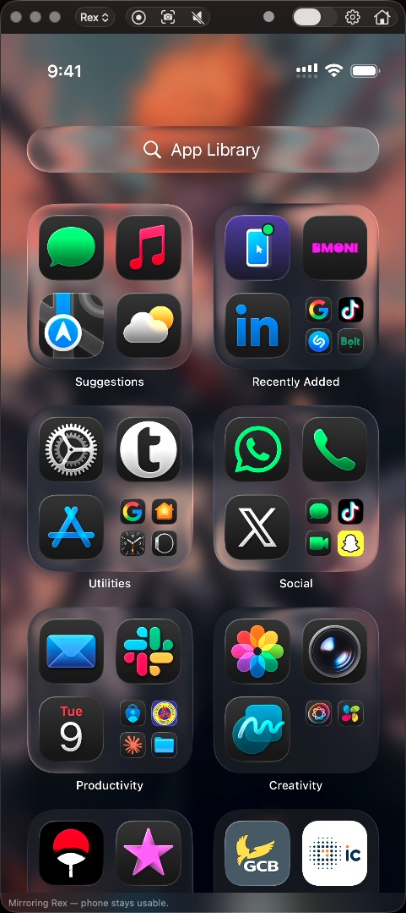
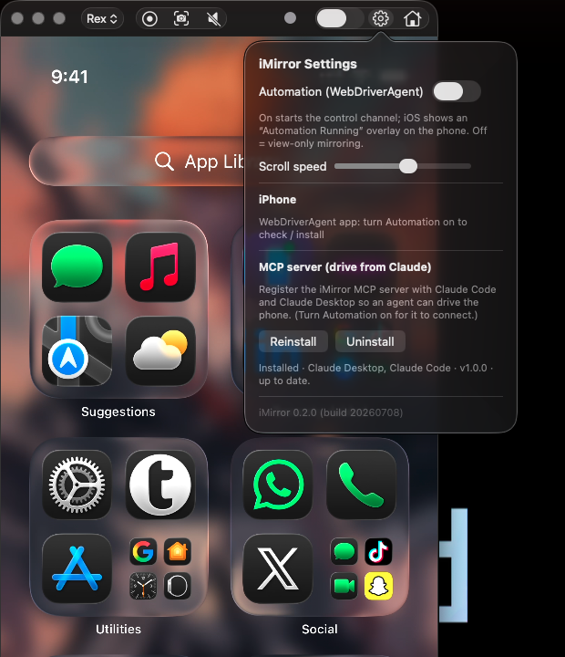

<div align="center">



# iMirror


[](https://github.com/kwamerex101/phone_screen_mirror/releases/latest)

**Mirror a USB-connected iPhone to a macOS window and control it from the Mac — while the phone stays physically usable.**

</div>

Unlike Apple's "iPhone Mirroring", the phone is never locked. iMirror is two
tools in one:

1. **A desktop mirror + remote control** — watch and drive the phone from a Mac
   window.
2. **An agent-driven test rig for real devices** — the bundled
   [MCP server](mcp-server/) lets an AI agent (e.g. Claude) run test flows on the
   physical phone — tap, scroll, type, assert by visible text — and emit a
   self-contained HTML report with screenshots, pass/fail sections, and a
   timelapse. Neither Appium nor Maestro packages real-device evidence reports
   this way; in practice this is the most distinctive part of the project.

Features:

- **The phone keeps its own audio.** iMirror renders the mirror from
  WebDriverAgent's MJPEG stream instead of grabbing the screen as a capture
  device, so iOS never reroutes audio to the Mac (the old CoreMediaIO/QuickTime
  behavior). The phone stays unlocked, usable, and audible while you watch and
  drive it, plus full-resolution PNG screenshots.
- **Toolbar** — Screenshot, a WDA health dot, Control, Settings, and Home.
- **Control** — tap, drag, two-finger trackpad scroll (with flick detection),
  type, Home, driven from the preview.
- **Agent control + test reports** — a full set of `ios_*` MCP tools, opt-in run
  recording, cover/TOC/infographics HTML reports (see
  [MCP server](#mcp-server-drive-the-phone-from-claude)).
- **Automation starts on launch.** Mirroring is built on WebDriverAgent, so the
  app brings it up automatically when it connects to the phone (no Xcode, no
  sudo, no terminal) — a toolbar health dot + auto-reconnect. iOS shows the
  "Automation Running" overlay while this runs; the phone stays unlocked and
  keeps its own audio the whole time. The Settings (⚙) popover has a
  scroll-speed control, a one-click **MCP server install**, the on-device
  **WebDriverAgent app status**, and the app version/build.
- **Auto-installs the runner** — on connect, the app checks whether the
  WebDriverAgent app is on the connected iPhone and installs the bundled build if
  it's missing, with progress and actionable errors (e.g. "not signed for this
  iPhone — re-sign for this device"). A pre-provisioned device just works.
- **iOS Simulator support** — no physical phone required: **Settings (⚙) → iOS
  Simulator** picks a booted simulator, brings up WebDriverAgent on it, and
  registers a dedicated `imirror-sim` MCP server, so an agent can drive and test
  simulator builds too. You view the sim in Apple's Simulator app; requires Xcode.

The app code is dependency-free Swift (AppKit, Network, CoreGraphics/ImageIO).
Control rides on two vetted, source-built tools —
[`go-ios`](https://github.com/danielpaulus/go-ios) and
[`WebDriverAgent`](https://github.com/appium/WebDriverAgent) — that live under
`tools/` (gitignored) and are bundled into the `.app` at package time.

## Screenshots

<div align="center">


&nbsp;&nbsp;


</div>

Left: an iPhone mirrored live to the Mac while the phone stays usable — the
mirror follows the phone's **physical orientation**, and tap/drag coordinates
adapt automatically. Right: the **Settings (⚙)** popover — scroll-speed, the
on-device **WebDriverAgent app status**, one-click **MCP server install**, and
the app version/build. (This screenshot predates the current toolbar, which is
now Screenshot, WDA, Control, Settings, Home.)

## Install

Grab the notarized DMG from the
[**latest release**](https://github.com/kwamerex101/phone_screen_mirror/releases/latest),
open it, and drag **iMirror** to Applications. The DMG bundles everything the app
needs — the `go-ios` helper and the WebDriverAgent runner — so there's no Xcode,
no Go, and no `tools/` setup.

1. Connect your iPhone by USB, unlock it, and tap **Trust**.
2. Open iMirror. It installs the WebDriverAgent runner on the phone if it's
   missing and brings it up automatically — the phone stays unlocked and keeps
   its own audio, though iOS shows the "Automation Running" overlay while this
   runs. The health dot goes green once the mirror is live.
3. To control the phone, flip **Control** in the toolbar.

> **One Apple caveat:** the bundled runner is dev-signed for registered devices.
> A brand-new iPhone that isn't in the signing profile can't be auto-installed —
> the app says so and points you at the re-sign step
> (`WDA_DESTINATION=id=<udid> ./scripts/build-wda.sh`). This is an Apple
> code-signing constraint, not a choice. See **Build from source** below.

## Build from source

Everything below is for **building the app yourself** (and producing the DMG
above). `tools/` is gitignored, so a fresh clone starts empty — the `go-ios`
binary and the WebDriverAgent `.ipa` are built here and then bundled into the
`.app` by `scripts/package.sh`.

### Requirements

- macOS 14+ on **Apple Silicon or Intel** — the released DMG is a universal2
  build (built/tested on macOS 26, Xcode 26, Swift 6.3)
- An iPhone connected by USB, unlocked, "Trust This Computer" accepted, with
  **Developer Mode** on (Settings → Privacy & Security → Developer Mode)
- A **paid Apple Developer account** to sign WebDriverAgent (a free account works
  but its cert expires every 7 days)
- For building the `go-ios` helper from source: **Go** and **osv-scanner**
  (`brew install go osv-scanner`)

### Set up `tools/` (one-time)

`tools/` is not committed (it holds large third-party clones). Populate it at the
audited, pinned versions — see [SECURITY-AUDIT.md](SECURITY-AUDIT.md) for the
exact commits and scan results:

```bash
mkdir -p tools && cd tools
git clone --depth 1 --branch v1.1.0 https://github.com/danielpaulus/go-ios
git clone --depth 1 --branch v9.9.0 https://github.com/appium/WebDriverAgent

# (optional but recommended) scan before building:
osv-scanner scan source -r --no-ignore --include-git-root go-ios
osv-scanner scan source -r --no-ignore --include-git-root WebDriverAgent

# build the go-ios CLI from source as a universal2 (arm64 + x86_64) binary,
# patching vulnerable transitive deps — one helper that runs on both Intel and
# Apple Silicon, so the packaged DMG does too:
cd ..            # back to repo root
./scripts/build-go-ios.sh
```

Then install WebDriverAgent on the device once (Xcode):

1. Open `tools/WebDriverAgent/WebDriverAgent.xcodeproj`.
2. Scheme **WebDriverAgentRunner**, destination = your iPhone.
3. For targets **WebDriverAgentRunner** + **WebDriverAgentLib**: Signing &
   Capabilities → *Automatically manage signing* → select your paid Team.
4. **Product → Test (⌘U)** — builds, signs, installs WDA; trust the developer
   cert on the phone when prompted. You can stop the test afterward — the app
   relaunches WDA itself (see below).

   Note: on newer Xcode (tested on Xcode 26), WDA's vendored XCTest headers trip
   clang's `-Wreserved-identifier`; a GUI build needs `-Wno-reserved-identifier`
   in `WARNING_CFLAGS`.

   **Command-line / rebranded build:** [`scripts/build-wda.sh`](scripts/build-wda.sh)
   builds, signs, and packages the runner into an installable `.ipa` from the
   terminal — handling the Xcode 26 accommodations for you (`-allowProvisioningUpdates`,
   warnings-as-errors off) — and fully rebrands the runner: **bundle id**
   (`com.local.imirror.WebDriverAgentRunner`), on-device **name** ("iMirror"), and
   **app icon** (the same logo as the Mac app, applied as a post-build patch +
   re-sign). So it installs as a first-class "iMirror" app under your own identity
   rather than `com.facebook.*`. Run it with your paid Team:
   `DEVELOPMENT_TEAM=<TEAMID> ./scripts/build-wda.sh`, then install with
   `tools/go-ios/bin/ios install --path=build/WebDriverAgent.ipa`. See the
   [rebrand design](docs/2026-07-03-rebrand-wda-and-improvements-design.md) for the
   why/how. (The macOS app's `runwda` is already wired to launch the branded id.)

### Run (from source)

```bash
./scripts/run.sh            # debug build → bundle (with go-ios + icon) → launch
./scripts/run.sh release    # optimized build
```

On launch the app connects to the iPhone and brings up WebDriverAgent
automatically (health dot green within ~30 s) — the phone stays unlocked and
keeps its own audio, though iOS shows the "Automation Running" overlay while
this runs. The mirror appears as soon as frames start arriving. **Screenshot**
saves a PNG of the latest frame.

Flip the **Control** switch to send taps / swipes / typing from the preview.
(On a narrow window, Control collapses into the toolbar's `»` overflow menu,
where it still works.) The Settings (⚙) popover also holds a scroll-speed
slider and the one-click **MCP server install** described below.

## How it works

**Video.** WebDriverAgent serves an MJPEG stream on the device (port 9100): a
multipart/x-mixed-replace sequence of JPEG frames. iMirror forwards that port
over USB, reads the stream on a raw socket, decodes each frame to a `CGImage`,
and draws it in the window — roughly 10–20 fps, tuned for glance-and-control
rather than smooth capture. Screenshots save the latest decoded frame as a PNG.
Frame rate and quality are tunable through WDA's session settings
(`mjpegServerFramerate`, `mjpegServerScreenshotQuality`). Since this isn't a
capture device, iOS never reroutes the phone's audio to the Mac, and the phone
is never locked.

**Control.** Clicks/keys on the preview are transformed to device points and sent
to WebDriverAgent (XCUITest) as W3C pointer/key actions. Control is off by
default and armed by the switch (only while the health dot is green).

Scrolling is two-finger trackpad scroll (or click-drag): the gesture is mapped to
a WDA swipe over the same path, respecting the system Natural-Scroll direction. A
fast release is detected as a *flick* and sent as one quick swipe so the scroll
jumps rather than crawling 1:1. Note WDA can't trigger iOS inertial momentum — a
swipe moves content ~1:1 and stops on release — so distance comes from a longer
swipe, not a faster one (the macOS momentum tail is intentionally dropped, since
the phone can't coast). The XCUITest "wait for quiescence" idle-wait is disabled
on session creation, which removes the multi-second stall that previously hit the
first swipe of a session.

**Self-managed transport.** On launch the app spawns `go-ios` as child processes
and runs an in-process loopback relay:

```
iMirror (CFNetwork)  → 127.0.0.1:8100 (relay) → :8101 (ios forward) --USB--> WDA HTTP  :8100
iMirror (raw socket) -------------------------→ :9110 (ios forward) --USB--> WDA MJPEG :9100
   ios tunnel start --userspace   iOS 17+ RSD tunnel (userspace = no root)
   ios runwda                     launches WebDriverAgent (no Xcode)
   ios forward 8101 8100          USB relay of WDA's HTTP port
   ios forward 9110 9100          USB relay of WDA's MJPEG stream
```

The MJPEG stream is read directly off its forwarded port over a raw socket, so
it skips the CFNetwork relay entirely — only the WDA HTTP path needs the relay
(see "Why the relay" below).

Children run with a writable working dir (`~/Library/Application Support/iMirror`)
and auto-restart on crash. `runwda` carries a readiness deadline: if WDA isn't
serving within ~40 s the runner is killed and respawned, since a wedged runner
otherwise never exits on its own. If that keeps failing, an escalation ladder
does a full chain restart (fresh tunnel, runner, and both forwards); if the
chain still won't come up, the app stops retrying and shows a "tap WDA to
retry" state instead of looping forever. A separate MJPEG no-frame watchdog
covers the case where WDA is healthy but no video frames arrive — it bounces
the MJPEG forward first, then escalates the same way. Before each bring-up the
app also sweeps any stray go-ios children left by a previously crashed
instance — most often a tunnel reparented to `launchd` that would otherwise
keep holding the device's RSD state and port 60105 and pin the dot on red. The
health dot shows **green**/**yellow**/**red** and the app auto-reconnects.

Why the relay: `go-ios forward` alone is incompatible with macOS CFNetwork
(URLSession gets `NSURLErrorNetworkConnectionLost` -1005, while plain socket
clients work). The loopback relay normalises the connection, keeping the USB
transport and loopback-only security. If the bundled go-ios is ever missing,
`scripts/wda-up.sh` + `scripts/wda_relay.py` are a manual fallback.

## Dependency security policy

Supply-chain risk is treated as a first-class constraint:

- **The app itself has zero third-party packages** — Apple system frameworks only.
- **The two control tools are vetted before use** (see [SECURITY-AUDIT.md](SECURITY-AUDIT.md)):
  pinned to exact tags + verified commits, scanned with `osv-scanner`, vulnerable
  transitive deps patched, and **built from source** (no prebuilt-binary trust).
- **No `curl | sh`, no unsigned binaries.** Anything executable is subject to
  macOS Gatekeeper / notarization.
- WebDriverAgent has no auth on the wire, so it is reached over **loopback only**;
  the go-ios host identity (`selfIdentity.plist`) is gitignored.

## MCP server (drive the phone from Claude)

[`mcp-server/`](mcp-server/) turns the phone into an **agent-driven test rig**.
An MCP client (e.g. Claude) controls the device directly — screenshot, tap,
swipe, scroll (by direction or until an element is visible), type, hardware
buttons, find-and-tap / wait-for by text, orientation, accessibility source,
app lifecycle (launch / terminate / activate / state / install), deep links,
clipboard, and pass/fail assertions — a full set of `ios_*` tools.

The standout is **test-run recording**: the agent starts a run, names the
sections it tests, asserts checkpoints as pass/fail, and finishes with a
self-contained HTML report — cover page with verdict, pass/fail donut and stat
cards, a failures-first panel, a "what was tested" table of contents, every
step with embedded screenshots, and a looping timelapse of the whole run.
Ask Claude to "test the login flow and give me a report" and you get reviewable
evidence from a *real* device — the distinctive part. (Prefer a simulator? See
**iOS Simulator** below.)

**One-click install.** The app's **Settings (⚙) → MCP server** section registers
this server with your MCP client(s) in one click — it makes a Python venv
(**requires Python 3.10+**; e.g. `brew install python`), installs `mcp[cli]`, and
registers with both **Claude Code** (`claude mcp add`) and **Claude Desktop** (a
safe merge into `claude_desktop_config.json` that leaves your other servers
untouched). It shows installed status + version and flags when a re-register is
needed. Prefer the manual route? See [mcp-server/README.md](mcp-server/README.md).

It talks to the same loopback WDA the app brings up — open iMirror and wait for
the green dot before driving the phone. See
[mcp-server/README.md](mcp-server/README.md) for the tool table and report
walkthrough.

**Headless automation.** The MCP server can also bring WebDriverAgent up on its
own, without the Mac app: set `IMIRROR_AUTOWDA=1` and it runs the same go-ios
tunnel / runwda / forward chain and talks to WDA directly. Useful for driving
the phone from an agent without launching the GUI.

**iOS Simulator (optional).** No phone handy, or testing a simulator build?
**Settings (⚙) → iOS Simulator** lists your simulators; pick one and **Enable** to
boot it and bring WebDriverAgent up on it (loopback `:8201`, so it coexists with a
physical device on `:8100`), then **Install** the `imirror-sim` MCP server. You
view and drive the sim through Apple's Simulator app and Claude — same `ios_*`
tools, plus simulator-only `sim_push` / `sim_privacy` / `sim_status_bar`.
**Requires Xcode**; the packaged app bundles the WebDriverAgent source and builds
it once with your Xcode on first Enable (cached afterward).

## Packaging / distribution

```bash
swift scripts/make_icon.swift   # regenerate Resources/AppIcon.icns (one-off)
./scripts/package.sh            # build a DMG (build/iMirror.dmg)
```

`package.sh` builds the release `.app` (bundling go-ios + icon) and makes a DMG.
With a **Developer ID Application** certificate it signs with hardened runtime +
the camera entitlement (and signs the nested go-ios), ready for notarization:

```bash
# one-time:
xcrun notarytool store-credentials imirror --apple-id <id> --team-id <TEAMID> --password <app-pw>
# then:
NOTARY_PROFILE=imirror ./scripts/package.sh   # signs, notarizes, staples
```

Without that cert it ad-hoc signs (runs locally; other Macs show a Gatekeeper
warning). The Mac App Store is not a target: the app spawns go-ios child
processes and drives WebDriverAgent, which the App Sandbox doesn't allow;
distribute the notarized DMG directly.

## Status / limitations

- **Working:** video mirror, screenshot, and control (tap, drag, two-finger
  trackpad scroll with flick detection, type incl. backspace/return/tab, Home).
  The phone keeps its own audio throughout, since mirroring no longer opens a
  capture device.
- **Not currently available:** recording to mp4. It depended on the old
  capture pipeline and was removed with it; it could be rebuilt from MJPEG
  frames later.
- **macOS only** by design. Cross-platform would mean the libusb /
  `quicktime_video_hack` path — a different architecture.
- **Latency:** video is an MJPEG frame stream at roughly 10–20 fps, not a
  frame-tight capture — the mirror trades smoothness for letting the phone keep
  its own audio. Control adds a WDA round-trip on top (tens–hundreds of ms per
  action). Scrolling is not frame-tight and has no inertial coast (a WDA
  limitation, not a tuning knob).
- **Not reachable** (XCUITest limitation): App Switcher, Control Center, Siri.
- **One physical device at a time** — the transport assumes a single phone and
  fixed loopback ports (8100/8101 for WDA HTTP, 9110/9100 for the MJPEG
  stream). Multi-device would need per-device port plumbing. A booted **iOS
  Simulator** runs on a separate WDA (`:8201`), so it can be enabled alongside a
  physical device.
- **Maintenance reality:** control depends on go-ios + WebDriverAgent tracking
  Apple's private wire protocols, so a new iOS major version can break the chain
  until those projects catch up. Pinned versions in
  [SECURITY-AUDIT.md](SECURITY-AUDIT.md) are what's actually tested.
- **Landscape** adapts via WDA `window/size` (refreshed each poll) but hasn't been
  physically rotation-tested.
- Relaunching the app in quick succession can still briefly wedge the device's
  `testmanagerd`. Recovery now escalates in stages: a readiness-deadline
  auto-restart of the runner, then a full chain restart, then (if the chain
  still won't come up) a hard-stop "tap WDA to retry" state rather than
  looping forever. A hard crash (rather than a clean quit) can orphan a go-ios
  child; the next launch sweeps it automatically.

## Credits

iMirror is independent software and contains no scrcpy source; it was inspired by
[scrcpy](https://github.com/Genymobile/scrcpy)'s "mirror + control over USB" idea
and applies the equivalent approach to iOS. Control is built on two open-source
tools, fetched into `tools/` at build time (see [SECURITY-AUDIT.md](SECURITY-AUDIT.md)):

- [go-ios](https://github.com/danielpaulus/go-ios) — MIT
- [WebDriverAgent](https://github.com/appium/WebDriverAgent) — Apache-2.0

Distributions that bundle the `go-ios` binary should include its MIT notice.

## Author

Theophilus RexDanquah — [rexdanquah.dev](https://rexdanquah.dev)

## License

MIT — see [LICENSE](LICENSE).
